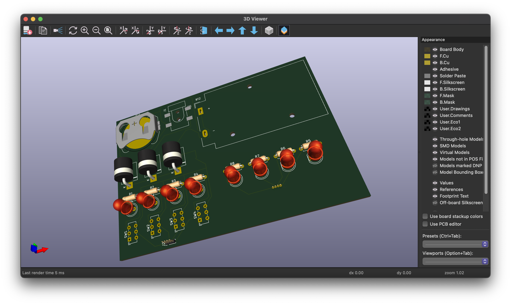

# Toasterboard

A very scuffed attempt at recreating a Breadboard Companion.

Made for the Hardware workshop led by Acon at [Hack Club Juice](juice.hackclub.com) utilizing a electronics kit from [Hack Club Solder](solder.hackclub.com).

